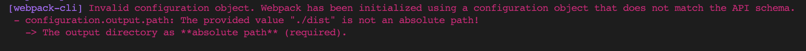

# WEBPACK

## Install

**webpack** - Core functionality of webpack.

**webpack-cli** - Webpack command line tool.

```terminal
$ npm install webpack webpack-cli -D
```

## Starting webpack

```terminal
$ npx webpack
```

## Get details of webpack build

```terminal
$ npx webpack --stats detailed
```

---

## Config Setup

**Create a webpack.config.js file at the root of your project**

---

## Errors



Problem: You specified a relative path in the output path configuration option.

Solution: Specify an absolute path using 'path'

**webpack.config.js**

```js
const path = require('path');

module.exports = {
  entry: './src/index.js',
  output: {
    filename: 'bundle.js',
    path: path.resolve(__dirname, './dist'),
  },
  mode: 'none',
};
```
